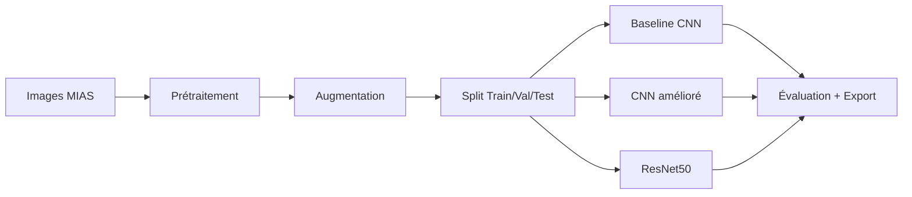

# Classification automatique de mammographies MIAS avec Deep Learning

[](https://www.python.org/downloads/)
[](https://tensorflow.org/)
[](LICENSE)

> Système d’aide au diagnostic pour la détection et la classification d’anomalies sur mammographies (dataset MIAS) via réseaux de neurones convolutifs.
> Projet pédagogique — non destiné à l’usage clinique.

## Table des matières
- [Objectif du projet](#objectif-du-projet)
- [Dataset MIAS](#dataset-mias)
- [Architecture](#architecture)
- [Installation rapide](#installation-rapide)
- [Structure du projet](#structure-du-projet)
- [Utilisation (notebooks)](#utilisation-notebooks)
- [Résultats](#résultats)
- [Limites et pistes d’amélioration](#limites-et-pistes-damélioration)
- [Brief métier (1 page)](#brief-métier-1-page)
- [Contribution](#contribution)
- [Licence](#licence)
- [Remerciements](#remerciements)

## Objectif du projet
- Explorer un pipeline DL pour la classification d’anomalies MIAS (7 classes).
- Comparer 3 approches: CNN baseline, CNN amélioré, transfert d’apprentissage (ResNet50).
- Reporter des métriques utiles (F1 macro, matrices de confusion, AUC ROC/PR).

## Dataset MIAS
- 330 mammographies, 7 classes : NORM (62.7%), CALC (9.1%), CIRC (7.6%), ARCH (5.8%), SPIC (5.8%), MISC (4.5%), ASYM (4.5%).
- Annotations expertes (coordonnées et rayons des lésions).
- Données non incluses pour raisons de taille/licence.

Téléchargement (exemple via Kaggle CLI) :
```bash
kaggle datasets download -d kmader/mias-mammography
unzip mias-mammography.zip -d data/raw/MIAS/
```

## Architecture


## Installation rapide
```bash
git clone https://github.com/elsanto131/breast_cancer_ML.git
cd breast_cancer_ML

python -m venv venv
# Linux/Mac
source venv/bin/activate
# Windows PowerShell
# .\venv\Scripts\activate

pip install -r requirements.txt
```

## Structure du projet
```
breast_cancer_ML/
├─ notebooks/
│  ├─ 01_data_exploration.ipynb
│  ├─ 02_mvp_baseline.ipynb
│  ├─ 03_model_comparison.ipynb
│  ├─ 04_results_analysis.ipynb
│  └─ 05_report_generation.ipynb
├─ results/
│  ├─ figures/
│  └─ metrics/
├─ models/
├─ data/
│  ├─ raw/MIAS/
│  └─ processed/
├─ scripts/
│  ├─ run_all.sh
│  └─ run_all.bat
├─ .gitignore
├─ requirements.txt
├─ CONTRIBUTING.md
├─ BUSINESS_BRIEF.md
└─ LICENSE
```

## Utilisation (notebooks)
1) Lancer Jupyter:
```bash
jupyter lab
```
2) Suivre l’ordre:
- 01_data_exploration.ipynb
- 02_mvp_baseline.ipynb
- 03_model_comparison.ipynb
- 04_results_analysis.ipynb
- 05_report_generation.ipynb

Chaque notebook:
- lit data/raw/MIAS/,
- entraîne/évalue,
- exporte figures et métriques (JSON/PNG) dans results/.

Exécution rapide (export minimal baseline):
```bash
# Linux/Mac
bash scripts/run_all.sh
# Windows
scripts\run_all.bat
```

## Résultats (indicatifs)
| Modèle        | Accuracy | Precision | Recall | F1-Score |
|---------------|---------:|----------:|------:|--------:|
| CNN Baseline  | 60.6%    | 38.2%     | 60.6% | 46.9%   |
| CNN Optimisé  | 57.6%    | 36.1%     | 57.6% | 44.5%   |
| ResNet50      | 9.1%     | 0.8%      | 9.1%  | 1.5%    |

Notes:
- Fort déséquilibre (NORM majoritaire) → privilégier F1 macro, PR AUC.
- Résultats sensibles au seed, au split et au prétraitement.
- La contre‑performance de ResNet50 suggère un ajustement du pipeline (1→3 canaux, preprocess_input, gel/dégel progressif, LR scheduling).

## Limites et pistes d’amélioration
- Petit dataset, 7 classes déséquilibrées, risque de sur/apprentissage.
- Améliorations: class_weight/focal loss, augmentation ciblée, k‑fold stratifié, Grad‑CAM/SHAP, rapport automatique dans results/.

## Brief métier (1 page)
Voir BUSINESS_BRIEF.md.

## Contribution
Voir CONTRIBUTING.md.

## Licence
MIT — voir LICENSE.

## Remerciements
- MIAS Database (Mammographic Image Analysis Society)
- BeCode (parcours IA)
- Communautés open source: TensorFlow, scikit‑learn, Matplotlib, etc.

---
Fichiers volumineux non versionnés: data/, models/, results/figures/, results/metrics/ (voir .gitignore).


Fichier: BUSINESS_BRIEF.md
----------------------------------------
# Business Brief — Prototype de classification MIAS (1 page)

Contexte
- Objectif: explorer un prototype d’aide à la décision pour la classification d’anomalies sur mammographies (MIAS).
- Périmètre: exercice pédagogique; non destiné à un usage clinique.

Problème métier
- Coût des faux négatifs élevé (lésion non détectée).
- Variabilité inter‑lecteurs; besoin d’outils d’aide et de standardisation.

Approche
- 3 modèles: CNN baseline, CNN amélioré, ResNet50 (transfert).
- Métriques: F1 macro, matrices de confusion, PR AUC par classe.

Résultats (indicatifs)
- Baseline ~60.6% acc, F1 macro ~0.47.
- Optimisé ~57.6% acc, F1 macro ~0.45.
- ResNet50 ~9.1% acc (pipeline à corriger).

Risques / limites
- Dataset petit et déséquilibré; généralisation limitée.
- Sensible au split et au prétraitement (1 vs 3 canaux).

Prochaines étapes (2 semaines de stage)
- Corriger pipeline ResNet50 (canaux + preprocess_input + fine‑tuning progressif).
- Ajouter class_weight/focal loss; calibration des probabilités.
- k‑fold stratifié + reporting ± écart‑type; PR AUC macro/micro.
- Intégrer Grad‑CAM/SHAP dans un rapport automatique (PDF).

Valeur attendue
- Base de discussion avec équipes Data/Radiologie.
- Cadre reproductible et extensible pour itérer rapidement.


Fichier: CONTRIBUTING.md
----------------------------------------
# Contribuer

Merci pour votre intérêt ! Pour contribuer :
1. Ouvrir une issue décrivant le problème/la proposition.
2. Forker le dépôt et créer une branche: `feat/xxx` ou `fix/xxx`.
3. Respecter PEP 8, ajouter des docstrings et (si applicable) des tests.
4. Documenter clairement l’impact dans la PR.

Checklist PR
- [ ] Code formaté (black/ruff) et lints OK.
- [ ] Ajout/maj du README si nécessaire.
- [ ] Notebooks nettoyés (sorties lourdes supprimées).
- [ ] Export des métriques/figures vers `results/`.

Convention de nommage
- Notebooks: `NN_description.ipynb` (NN = 2 chiffres).
- Scripts: verbes clairs `train_*.py`, `evaluate_*.py` (si ajoutés plus tard).


Fichier: .gitignore
----------------------------------------
# Environnements
venv/
.env

# Notebooks
.ipynb_checkpoints/

# Données / modèles / résultats lourds
data/
models/
results/figures/
results/metrics/

# Systèmes
.DS_Store
Thumbs.db

# Logs
logs/
*.log


Fichier: requirements.txt
----------------------------------------
numpy
pandas
scikit-learn
matplotlib
seaborn
jupyterlab
tensorflow>=2.9
opencv-python
tqdm
nbconvert


Fichier: scripts/run_all.sh
----------------------------------------
#!/usr/bin/env bash
set -e

# Exécution guidée pour repro rapide via notebooks
# Nécessite jupyter et nbconvert

ROOT_DIR="$(cd "$(dirname "${BASH_SOURCE[0]}")/.." && pwd)"
cd "$ROOT_DIR"

echo "[1/3] Exécution 02_mvp_baseline.ipynb (export métriques/figures)"
jupyter nbconvert --to notebook --execute notebooks/02_mvp_baseline.ipynb --output notebooks/02_mvp_baseline_out.ipynb

echo "[2/3] Exécution 03_model_comparison.ipynb"
jupyter nbconvert --to notebook --execute notebooks/03_model_comparison.ipynb --output notebooks/03_model_comparison_out.ipynb

echo "[3/3] Exécution 04_results_analysis.ipynb"
jupyter nbconvert --to notebook --execute notebooks/04_results_analysis.ipynb --output notebooks/04_results_analysis_out.ipynb

echo "Terminé. Voir dossier results/ pour les exports."


Fichier: scripts/run_all.bat
----------------------------------------
@echo off
setlocal enabledelayedexpansion

REM Exécution guidée via notebooks — nécessite jupyter et nbconvert
cd /d %~dp0
cd ..

echo [1/3] 02_mvp_baseline.ipynb
jupyter nbconvert --to notebook --execute notebooks/02_mvp_baseline.ipynb --output notebooks/02_mvp_baseline_out.ipynb

echo [2/3] 03_model_comparison.ipynb
jupyter nbconvert --to notebook --execute notebooks/03_model_comparison.ipynb --output notebooks/03_model_comparison_out.ipynb

echo [3/3] 04_results_analysis.ipynb
jupyter nbconvert --to notebook --execute notebooks/04_results_analysis.ipynb --output notebooks/04_results_analysis_out.ipynb

echo Terminé. Voir results\ pour les exports.


Fichier: LICENSE
----------------------------------------
MIT License

Copyright (c) 2025 

Permission is hereby granted, free of charge, to any person obtaining a copy
of this software and associated documentation files (the “Software”), to deal
in the Software without restriction, including without limitation the rights 
to use, copy, modify, merge, publish, distribute, sublicense, and/or sell 
copies of the Software, and to permit persons to whom the Software is 
furnished to do so, subject to the following conditions:

The above copyright notice and this permission notice shall be included 
in all copies or substantial portions of the Software.

THE SOFTWARE IS PROVIDED “AS IS”, WITHOUT WARRANTY OF ANY KIND, EXPRESS 
OR IMPLIED, INCLUDING BUT NOT LIMITED TO THE WARRANTIES OF MERCHANTABILITY, 
FITNESS FOR A PARTICULAR PURPOSE AND NONINFRINGEMENT. IN NO EVENT SHALL 
THE AUTHORS OR COPYRIGHT HOLDERS BE LIABLE FOR ANY CLAIM, DAMAGES OR OTHER 
LIABILITY, WHETHER IN AN ACTION OF CONTRACT, TORT OR OTHERWISE, ARISING 
FROM, OUT OF OR IN CONNECTION WITH THE SOFTWARE OR THE USE OR OTHER 
DEALINGS IN THE SOFTWARE.
```
