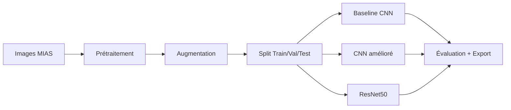

# Classification automatique de mammographies MIAS avec Deep Learning

[](https://www.python.org/downloads/)
[](https://tensorflow.org/)
[](LICENSE)

> Système d’aide au diagnostic pour la détection et la classification d’anomalies sur mammographies (dataset MIAS) via réseaux de neurones convolutifs.  
> Projet pédagogique — non destiné à l’usage clinique.

## Table des matières
- [Objectif du projet](#objectif-du-projet)
- [Dataset MIAS](#dataset-mias)
- [Architecture](#architecture)
- [Installation rapide](#installation-rapide)
- [Structure du projet](#structure-du-projet)
- [Utilisation (notebooks)](#utilisation-notebooks)
- [Résultats](#résultats)
- [Limites et pistes d’amélioration](#limites-et-pistes-damélioration)
- [Contribution](#contribution)
- [Licence](#licence)
- [Remerciements](#remerciements)

## Objectif du projet
- Explorer un pipeline DL pour la classification d’anomalies MIAS (7 classes).
- Comparer 3 approches: CNN baseline, CNN amélioré, transfert d’apprentissage (ResNet50).
- Reporter des métriques utiles (F1 macro, matrices de confusion, AUC ROC/PR).

## Dataset MIAS
- 330 mammographies, 7 classes : NORM (62.7%), CALC (9.1%), CIRC (7.6%), ARCH (5.8%), SPIC (5.8%), MISC (4.5%), ASYM (4.5%).
- Annotations expertes (coordonnées et rayons des lésions).
- Données non incluses pour raisons de taille/licence.

Téléchargement (exemple via Kaggle CLI) :
```bash
kaggle datasets download -d kmader/mias-mammography
unzip mias-mammography.zip -d data/raw/MIAS/
```

## Architecture


## Installation rapide
```bash
# Cloner CE dépôt
git clone https://github.com/elsanto131/breast_cancer_ML.git
cd breast_cancer_ML

# Créer l'environnement
python -m venv venv

# Activer
# Linux/Mac
source venv/bin/activate
# Windows PowerShell
.\venv\Scripts\Activate.ps1

# Installer les dépendances
pip install -r requirements.txt
```

## Structure du projet
```
breast_cancer_ML/
├─ notebooks/
│  ├─ 01_data_exploration.ipynb
│  ├─ 02_mvp_baseline.ipynb
│  ├─ 03_model_comparison.ipynb
│  ├─ 04_results_analysis.ipynb
│  └─ 05_report_generation.ipynb
├─ models/                # (vidé/ignoré dans git)
├─ data/                  # (non versionné : raw/MIAS, processed/)
├─ results/               # figures/, metrics/
├─ .gitignore
├─ requirements.txt
└─ LICENSE
```

## Utilisation (notebooks)
1) Lancer Jupyter:
```bash
jupyter lab
```

2) Suivre l’ordre:
- 01_data_exploration.ipynb
- 02_mvp_baseline.ipynb
- 03_model_comparison.ipynb
- 04_results_analysis.ipynb
- 05_report_generation.ipynb

Chaque notebook:
- lit les données depuis `data/raw/MIAS/`,
- entraîne/évalue les modèles,
- exporte figures et métriques (PNG/JSON) dans `results/`.

## Résultats
Performances indicatives (exemple) :
| Modèle        | Accuracy | Precision | Recall | F1-Score |
|---------------|---------:|----------:|------:|--------:|
| CNN Baseline  | 60.6%    | 38.2%     | 60.6% | 46.9%   |
| CNN Optimisé  | 57.6%    | 36.1%     | 57.6% | 44.5%   |
| ResNet50      | 9.1%     | 0.8%      | 9.1%  | 1.5%    |

Notes:
- Fort déséquilibre (NORM majoritaire) → privilégier F1 macro et PR‑AUC.
- Résultats sensibles au seed, au split et au prétraitement.
- La sous‑performance de ResNet50 suggère d’ajuster le pipeline (1→3 canaux, preprocess_input, gel/dégel progressif, scheduler LR).

## Limites et pistes d’amélioration
- Dataset petit et déséquilibré → risque de sur/apprentissage.
- Pistes: `class_weight`/focal loss, augmentation ciblée, k‑fold stratifié, Grad‑CAM/SHAP, rapport automatique dans `results/`.

## Contribution
Les contributions sont bienvenues (issues/PR). Merci de nettoyer les sorties lourdes des notebooks avant commit et de respecter PEP 8.

## Licence
MIT — voir [LICENSE](LICENSE).

## Remerciements
- MIAS Database : Mammographic Image Analysis Society.  
- BeCode et mon coach.  
- Ma classe Thomas 5 : entraide, revues de code et tests.  
- NRB 
- Communauté Open Source (TensorFlow, scikit‑learn, matplotlib).
