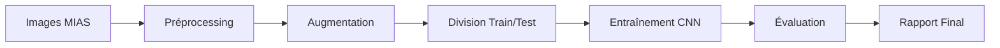

# Classification Automatique de Mammographies MIAS avec Deep Learning

[](https://www.python.org/downloads/)
[](https://tensorflow.org/)
[](https://opensource.org/licenses/MIT)

> **Projet d'Intelligence Artificielle pour la détection et classification d'anomalies mammographiques utilisant des réseaux de neurones convolutifs (CNN)**

## Table des Matières

- [Objectif du Projet](#-objectif-du-projet)
- [Dataset MIAS](#-dataset-mias)
- [Architecture](#️-architecture)
- [Installation Rapide](#-installation-rapide)
- [Utilisation](#-utilisation)
- [Résultats](#-résultats)
- [Documentation](#-documentation)
- [Contribution](#-contribution)
- [Licence](#-licence)

## Objectif du Projet

Ce projet développe un système d'aide au diagnostic pour la **classification automatique d'anomalies mammographiques** en utilisant le célèbre dataset MIAS (Mammographic Image Analysis Society).

### Problématique

- **Détection précoce** : Améliorer la détection du cancer du sein
- **Assistance médicale** : Aider les radiologues dans l'interprétation des mammographies
- **Standardisation** : Réduire la variabilité inter-observateur

### Objectifs Techniques

- Classifier 7 types d'anomalies mammographiques
- Comparer 3 architectures CNN (Baseline, Optimisé, ResNet50)
- Atteindre une précision >60% sur le dataset de test
- Fournir des métriques cliniquement pertinentes

## Dataset MIAS

### Composition
- **330 mammographies** digitalisées en haute résolution
- **7 classes d'anomalies** : NORM, CALC, CIRC, ARCH, SPIC, MISC, ASYM
- **Annotations expertes** avec coordonnées et rayons des lésions

### Classes d'Anomalies

| Classe   | Description                 | Nombre d'échantillons |
|----------|-----------------------------|-----------------------|
| **NORM** | Images normales             | 207 (62.7%)           |
| **CALC** | Calcifications              | 30 (9.1%)             |
| **CIRC** | Masses circulaires          | 25 (7.6%)             |
| **ARCH** | Distorsions architecturales | 19 (5.8%)             |
| **SPIC** | Masses spiculées            | 19 (5.8%)             |
| **MISC** | Anomalies diverses          | 15 (4.5%)             |
| **ASYM** | Asymétries                  | 15 (4.5%)             |

## Architecture

### Modèles Développés

1. **CNN Baseline** : Architecture simple de référence
2. **CNN Optimisé** : Amélioration avec dropout et couches supplémentaires
3. **ResNet50** : Transfer learning avec architecture pré-entraînée

### Pipeline de Traitement



## Installation Rapide

### Prérequis

- Python 3.8+
- GPU recommandé (CUDA compatible)
- 8GB RAM minimum

> **Note** : Les notebooks utilisent des chemins locaux pour accéder aux données (`data/raw/MIAS/`, `data/processed/`).  
> Assurez-vous de télécharger le dataset MIAS avant d’exécuter les notebooks.

### Télécharger le dataset MIAS via Kaggle

[Kaggle MIAS Mammography Dataset](https://www.kaggle.com/datasets/kmader/mias-mammography)

```bash
kaggle datasets download -d kmader/mias-mammography
```

### Installation

```bash
# Cloner le repository
git clone https://github.com/username/breast_cancer_nrb.git
cd breast_cancer_nrb

# Créer un environnement virtuel
python -m venv venv
source venv/bin/activate  # Linux/Mac
# ou
venv\Scripts\activate     # Windows

# Installer les dépendances
pip install -r requirements.txt

# Télécharger le dataset MIAS (si nécessaire)
python scripts/download_data.py
```

### Dépendances Principales

```txt
tensorflow>=2.8.0
numpy>=1.21.0
pandas>=1.3.0
matplotlib>=3.5.0
scikit-learn>=1.0.0
Pillow>=8.3.0
jupyter>=1.0.0
seaborn>=0.11.0
```

## Utilisation

### Notebooks Jupyter (Approche Pédagogique)

```bash
# Lancer Jupyter Lab
jupyter lab

# Suivre les notebooks dans l'ordre :
# 1. 01_data_exploration.ipynb
# 2. 02_mvp_baseline.ipynb  
# 3. 03_model_comparison.ipynb
# 4. 04_results_analysis.ipynb
# 5. 05_report_generation.ipynb
```

### Scripts Python (Approche Production)

```bash
# Entraîner tous les modèles
python scripts/train_models.py

# Évaluer les performances
python scripts/evaluate_models.py

# Générer le rapport final
python scripts/generate_report.py
```

### Utilisation Avancée

```python
from src.models.cnn_models import build_optimized_cnn
from src.data.data_loader import load_mias_data

# Charger les données
X_train, X_test, y_train, y_test = load_mias_data()

# Créer et entraîner un modèle
model = build_optimized_cnn(input_shape=(128, 128, 1), num_classes=7)
model.compile(optimizer='adam', loss='sparse_categorical_crossentropy')
model.fit(X_train, y_train, validation_data=(X_test, y_test))
```

## Résultats

### Performances des Modèles

| Modèle           | Accuracy | Precision | Recall  | F1-Score |
|------------------|----------|-----------|---------|----------|
| **CNN Baseline** | 60.6%    | 38.2%     | 60.6%   | 46.9%.   |
| **CNN Optimisé** | 57.6%.   | 36.1%     | 57.6%.  | 44.5%    |
| **ResNet50**     | 9.1%     | 0.8%      | 9.1%    | 1.5%     |

### Insights Clés

- **Modèle Baseline** : Meilleure performance globale
- **Déséquilibre des classes** : Impact majeur sur les performances
- **Classes minoritaires** : Difficiles à détecter (ARCH, SPIC, MISC)
- **Potentiel d'amélioration** : Techniques d'équilibrage nécessaires

### Défis Identifiés

1. **Déséquilibre sévère** : 62.7% d'images normales
2. **Dataset limité** : 330 échantillons pour 7 classes
3. **Complexité médicale** : Subtilité des anomalies

## Documentation

### Notebooks Détaillés

- **[01_data_exploration.ipynb](notebooks/01_data_exploration.ipynb)** : Analyse exploratoire complète
- **[02_mvp_baseline.ipynb](notebooks/02_mvp_baseline.ipynb)** : Modèle de référence
- **[03_model_comparison.ipynb](notebooks/03_model_comparison.ipynb)** : Comparaison d'architectures
- **[04_results_analysis.ipynb](notebooks/04_results_analysis.ipynb)** : Analyse approfondie des résultats
- **[05_report_generation.ipynb](notebooks/05_report_generation.ipynb)** : Rapport final automatisé

### Documentation Technique

- **[Méthodologie](docs/methodology.md)** : Approche scientifique détaillée
- **[Architectures](docs/model_architecture.md)** : Spécifications techniques des modèles
- **[Interprétation](docs/results_interpretation.md)** : Analyse clinique des résultats

## Contribution

### Développement

```bash
# Fork le projet
git clone https://github.com/votre-username/breast_cancer_nrb.git

# Créer une branche feature
git checkout -b feature/nouvelle-fonctionnalite

# Commiter vos changements
git commit -m "Add: nouvelle fonctionnalité"

# Pousser vers la branche
git push origin feature/nouvelle-fonctionnalite

# Ouvrir une Pull Request
```

### Tests

```bash
# Lancer les tests unitaires
python -m pytest tests/

# Vérifier la couverture
python -m pytest --cov=src tests/
```

### Standards de Code

- **PEP 8** : Respecter les conventions Python
- **Type Hints** : Utiliser les annotations de type
- **Docstrings** : Documenter toutes les fonctions
- **Tests** : Couvrir les nouvelles fonctionnalités

## Licence

Ce projet est sous licence MIT. Voir le fichier [LICENSE](LICENSE) pour plus de détails.

---

## Remerciements

- **MIAS Database** : Mammographic Image Analysis Society
- **BeCode** : Formation en Intelligence Artificielle
- **Communauté Open Source** : TensorFlow, Scikit-learn, Matplotlib

---

## Références

1. Suckling, J. et al. (1994). "The mammographic image analysis society digital mammogram database"
2. LeCun, Y. et al. (1989). "Backpropagation applied to handwritten zip code recognition"
3. He, K. et al. (2016). "Deep residual learning for image recognition"

---

*Merci à NRB et Becode pour m'avoir donné l'opportunité de travailler sur ce use case :-)*


## ⚠️ Note Importante - Fichiers Volumineux

### Fichiers Exclus du Repository

En raison de la **taille des fichiers** et des limitations de GitHub, les éléments suivants ne sont **PAS inclus** dans ce repository :

#### **Données (data/)**
- **Images MIAS** : `data/raw/MIAS/` (~500MB)
- **Données préprocessées** : `data/processed/*.npy` (~200MB)
- **Métadonnées** : `data/*.csv`

#### **Modèles Entraînés (models/)**
- **Modèles sauvegardés** : `*.keras` (~50-100MB chacun)
- **Historiques d'entraînement** : `*.pkl` (~10-20MB chacun)
- **Checkpoints** : `*.ckpt`

#### **Résultats (results/)**
- **Graphiques générés** : `results/figures/*.png`
- **Rapports** : `results/reports/`
- **Métriques** : `results/metrics/`

### Comment Obtenir les Données

#### **Option 1 : Dataset MIAS Original**
```bash
# Télécharger depuis le site officiel MIAS
wget http://peipa.essex.ac.uk/info/mias.html
# Extraire dans data/raw/MIAS/
```

#### **Option 2 : Script Automatique**
```bash
# Exécuter le script de téléchargement
python scripts/download_data.py
```

#### **Option 3 : Kaggle**
```bash
# Via Kaggle CLI
kaggle datasets download -d kmader/mias-mammography
```

### Génération des Fichiers Manquants

Une fois le dataset téléchargé, exécutez les notebooks dans l'ordre pour régénérer :

1. **Données préprocessées** : `01_data_exploration.ipynb`
2. **Modèles entraînés** : `02_mvp_baseline.ipynb` → `03_model_comparison.ipynb`
3. **Résultats et graphiques** : `04_results_analysis.ipynb` → `05_report_generation.ipynb`

### Taille Approximative des Fichiers

| Catégorie                 | Taille Totale | Description                                     |
|---------------------------|---------------|-------------------------------------------------|
| **Images MIAS**           | ~500 MB       | 330 mammographies en PNG                        |
| **Données préprocessées** | ~200 MB       | Arrays NumPy (X_train, X_test, y_train, y_test) |
| **Modèles entraînés**     | ~150 MB       | 3 modèles CNN (.keras)                          |
| **Historiques**.          | ~50 MB        | Historiques d'entraînement (.pkl)               |
| **Résultats**             | ~20 MB        | Graphiques et rapports générés                  |
| **TOTAL**                 | **~920 MB*.   | Trop volumineux pour GitHub gratuit             |

### Alternative : Git LFS

Pour les projets futurs, considérez **Git Large File Storage (Git LFS)** :

```bash
# Installer Git LFS
git lfs install

# Tracker les gros fichiers
git lfs track "*.keras"
git lfs track "*.npy"
git lfs track "data/**"

# Commit normalement
git add .gitattributes
git commit -m "Add Git LFS tracking"
```

---

*Cette approche maintient un repository léger tout en préservant la reproductibilité du projet*